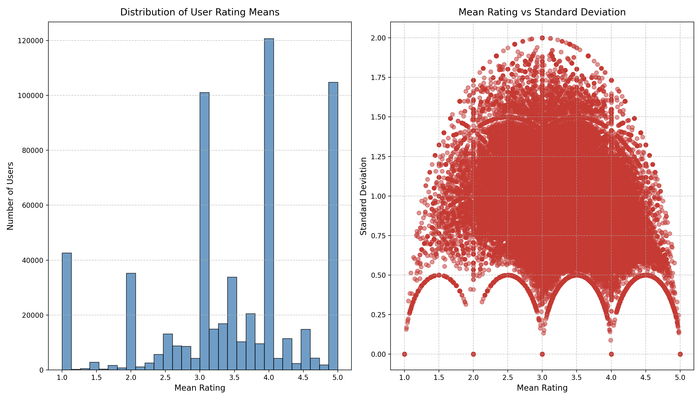
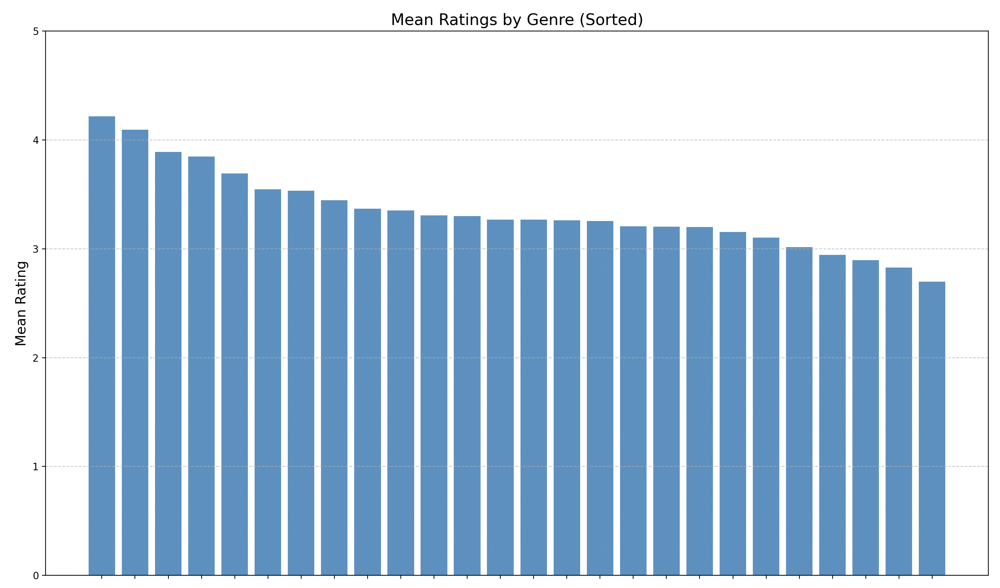

# 🎬 FilmDataAnalysis

基于 Hadoop 与 Spark 的电影大数据分析项目，探索电影历史趋势、观众评分行为和多维影响因素，服务于学术研究、内容制作与市场策略制定。

---

## 📓 数据来源
豆瓣近20年用户的电影评价数据

## 📁 项目结构

```
FilmDataAnalysis/
├── FilmDataAnalysis/     # Scala 实现的各阶段数据处理与分析文件
├── python/               # Python 可视化模块及结果图（含分类子文件夹）
│   ├── S1~S8/            # 不同主题的可视化脚本（如 S1 历史趋势）
│   └── Fxx.png           # 可视化结果图像
│   ├── doc.pdf           # 文档         
```

---

## 🚀 技术栈

- Hadoop HDFS, Apache Spark, Scala
- pandas, numpy, matplotlib, seaborn
- 项目使用 IntelliJ IDEA + Maven + Python 环境部署

---

## ▶️ 快速开始

1. 上传数据至 HDFS：

```bash
hdfs dfs -mkdir /filmdata
hdfs dfs -put movies.csv /filmdata/
hdfs dfs -put ratings.csv /filmdata/
```

2. 编译并运行 Scala 分析脚本：

```bash
spark-submit --class S11_dataProcess target/FilmDataAnalysis.jar
```

3. 进入 python 目录运行可视化脚本：

```bash
cd python/S1_电影评分的历史趋势
python s1_plot.py
```

---

## 📈 数据分析亮点（含部分结论与可视化展示，完整见doc.pdf）

### S1. 🎞️ 电影评分历史趋势分析
**分析目标**：通过年份统计电影评分变化趋势，研究电影整体质量与评分演变。

**结论摘要**：
- 平均评分整体呈波动下降趋势，尤其在 21 世纪后期明显。
- 评分分布两极化，高分与低分电影数量均上升，电影质量分化严重。


---

### S2. 🕒 评分时间分布分析
**分析目标**：从年份、季节、小时三个维度研究评分行为的变化与趋势。

**结论摘要**：
- 年份：评分数量快速增长，评分极化现象明显。
- 季节：夏季评分最多且高分比例大，春秋评分偏少。
- 小时：晚间评分活跃且高分多，凌晨偏低，反映观众情绪差异。




---

### S3. 🌍 评分与地区关系分析
**分析目标**：构建电影质量指标，比较不同国家/地区电影评分表现与产业成熟度。

**结论摘要**：
- 苏联、捷克等国家电影质量高且评分集中。
- 印度评分波动大，制作质量不稳定。
- 评分指标有效反映国家电影工业发展水平。


---

### S4. 🎭 类型与评分关系分析
**分析目标**：分析不同类型电影的均分与评分分布差异，揭示观众偏好。

**结论摘要**：
- 古装、武侠类型平均评分最高。
- 灾难、惊悚评分偏低。
- 剧情、喜剧评分数量最多，市场主流类型。


---

### S5. ⏱️ 时长与评分关系分析
**分析目标**：探究电影时长与评分的关系，评估时长对观众观影体验的影响。

**结论摘要**：
- 短片评分集中且更高，观众接受度好。
- 长片评分波动大，预期落差或疲劳效应明显。
- 建议在影片质量与时长之间做好平衡。




---

### S6. 🎬 导演与评分关系分析
**分析目标**：分析不同导演执导作品的评分差异，评估其对观众满意度的影响。

**结论摘要**：
- 高评分导演评分集中在 6~8 分，观众信任度高。
- 部分导演评分不稳定，频繁执导不等于高质量。
- 有助于制作方合理选择导演。


---

### S7. 🙋 用户评分行为分析
**分析目标**：统计用户整体评分习惯，识别保守/极端评分群体。

**结论摘要**：
- 多数评分集中在 3~4 星，评分保守。
- 极端评分较少，大多数用户评分标准差低。
- 用户群体评分较为稳定。


---

### S8. 🔍 冷门佳作分析
**分析目标**：发掘高评分但少人评价的“冷门神作”，提升推荐系统公平性。

**结论摘要**：
- 存在评分高但关注度低的优质电影。
- 冷门指数有助于发现被埋没的好片。
- 应加强推荐系统对小众精品的支持。


---

